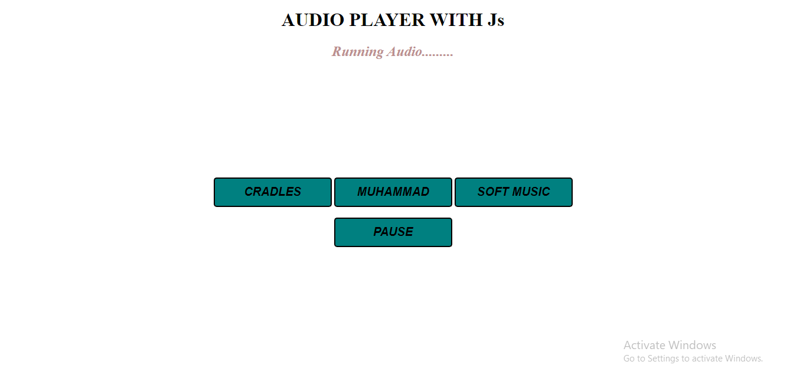

# Audio-Player  

<h3> 📝📝 DESCRIPTION</h3>
  

It's a simple website built with html,css and javascript.I practiced javascript's Audio method in this project.You can play three audio in this website.🙆‍♂️🙆‍♂️

<h3>🛠🛠 TOOLS</h3>
<ul>
  <li><h5>HTML5</h5></li>
  <li><h5>CSS3</h5></li>
  <li><h5>JAVA SCRIPT</h5></li>
</ul>
  
### 🎨PREVIEW 

 <h3>🔗🔗Live Preview</h3>
 
 <a href="https://sohaghossainpappu.github.io/JavaScript/Audio-Player/">Audio-Player</a>
